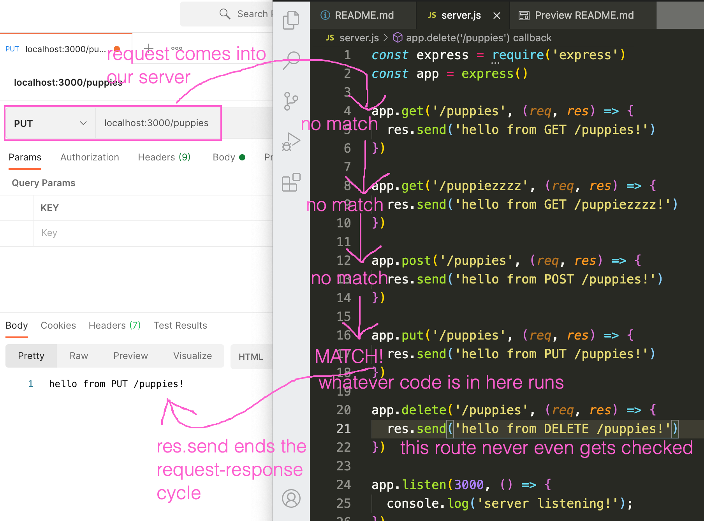

# Intro to Express

## What is Express?
Express is a package that we can install with npm. We are going to use it to build our first API. It lets us receive incoming web requests based on their http verb and route. Pop quiz: identify the http verb and route for this request:
```
GET http://your-new-api.com/puppies
```

## Getting Started
1. We want to install some packages with npm. So, in this directory, `npm init`
2. `npm install express`; a wild `node_modules` folder has appeared! What should you do? (hint: you wouldn't want to commit it...)
3. Create a new file called `server.js`
4. Add to `server.js`: `const express = require('express')`. Note that this string doesn't start with a `./`: that's because we want to require a 3rd party package that we installed. This is just a rule of how `require` works.
5. Add to `server.js`: `const app = express()`
6. Add to `server.js`:
```js
app.get('/puppies', (req, res) => {
  res.send('You have reached the GET /puppies route!')
})
```
7. Add to `server.js`:
```js
app.listen(3000, () => {
  console.log('the server is listening!')
})
```
8. From the command line, `node server.js`. You should see `'the server is listening!'` print out. Your server is now waiting to receive requests.
9. Open up Postman. Make a GET request to `localhost:3000/puppies`.

## What the heck just happened
1. What happened in steps 4-5? Why does it take 2 steps to set up the express app? Short answer: that's just how the authors of express decided it had to be. Long answer: the `express` variable contains much more than just the ability to make an API; we just cherry-picked the API capabilities out of it. Later we'll use more properties of the `express` variable.
1. In step 6, we established the first _route_ of our API. Think of our app as a house, and a route is one door of the house that someone can come knock on asking for information. We have some experience with routes from the unit 1 group project.
1. In step 7, we tell our app to listen for requests on port 3000. The callback function runs any time that we start our server. Note that we could put any code we want into that callback function and it would run!
1. In our postman request, `localhost` stands for the IP address of your own machine. It is synonymous with `127.0.0.1`, which we've been putting in our config.json. The 3000 is the port that we told our server to listen on. And `/puppies` is our route.

## Adding more routes
In our server, underneath our puppies route, add another of your choice. Use the GET verb but a different route string. Inside the route, all it should do is `res.send()` a string that lets you know what route you've hit. Then keep adding routes until you have at least one with each of the 4 http verbs.

Note that after adding a route, your server will not know about it until you restart the server. You can kill the running server with `ctrl + C`, and restart it with another `node server.js`.

## Seeing routes through express's eyes
When a request comes into your server, express starts at the top of `server.js` and compares the incoming request to every available route. When it finds a match, it runs WHATEVER code is in that route handler (hint hint: soon, we will run our sequelize functions in these route handlers!). Once a matching route is found, `res.send` ends the search for a matching route: any remaining routes beneath our match are not even attempted.



What happens if a request makes it all the way to the end of `server.js` without finding a matching route handler?

## Quality of life improvements
### Tired of restarting your server?
Restarting our server after adding every route is getting old! What if there was a tool that automatically restarted it for us every time we changed our `server.js`?
1. `npm install -g nodemon`: the `-g` is for "global", because we want nodemon in every project from now on.
1. `nodemon server.js`: nodemon is now watching `server.js` to see if it ever gets changed & re-saved.
1. Make a change to your `server.js` and save it.
1. Look at your terminal to see that the server did in fact restart: `'the server is listening!'` printed again!

You'll never have to install nodemon again, you can just `nodemon <any-js-file>` in any future project to automatically re-run it whenever it changes.

### Are your routes getting hard to keep track of?
As we build more routes, it's going to get harder to keep track of them all. Let's install a tool that gives us a quick summary of all our routes.
1. `npm i rowdy-logger`
2. In `server.js`, after creating `app` but before any routes:
```js
const rowdy = require('rowdy-logger')
const routesReport = rowdy.begin(app)
```
3. Right underneath our message that the server has started: `routesReport.print()`
4. Restart your server (or let nodemon do it for you) to see your routes summary!

## Accepting user data
### What are `req` and `res`?
In each of our route handlers, `res` is an object that contains all information pertaining to the _response_ that will eventually get sent back to the client. That's why we use `res.send` to include some text in the response. You can always `console.log(res)` to see what all is in there.

`req` is an object that contains all information pertaining to the incoming _request_. It's going to contain all incoming data that the user is sending us.

### URL params
Remember making requests like this?
```js
fetch('http://some-api.com/wines/5')
```
In this request, the 5 is a _URL parameter_. Let's set up a route that accepts a URL parameter:
```js
app.get('/puppies/:id', (req, res) => {
  console.log(req.params)
  res.send(`Seems like you are looking for puppy number ${req.params.id}`)
})
```
Our route string now has 2 slashes in it, chopping our route into segments. Any segment that starts with a `:` is a wildcard placeholder: it's a slot for the user to supply their own URL parameter. It prepares our route to receive this url info from the user.

Hit this route with postman, supplying a number for `:id`, and see what happens!

### Body data
Remember making requests like this?
```js
fetch('http://some-api.com/wines/', {
  method: 'POST',
  body: JSON.stringify({
    name: 'Fine Wine',
    description: "It's fine"
  })
})
```
Let's set up a route that is able to receive body data. I already have a `POST /puppies` route, but some setup is required to access the body data.

In `server.js`, right before all our routes:
```js
app.use(express.json())
```
This prepares our api to receive json data from the body of all incoming requests.

In our `POST /puppies` route, `console.log(req.body)`. Then use postman to hit that route with some body data and see what happens!
